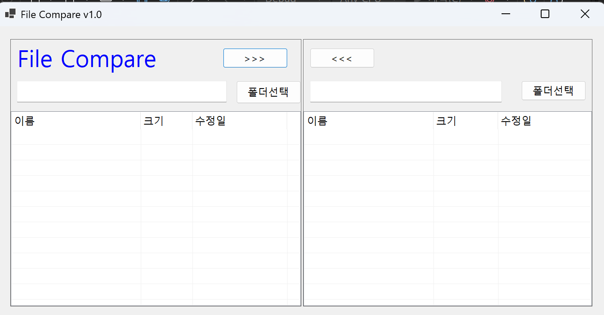
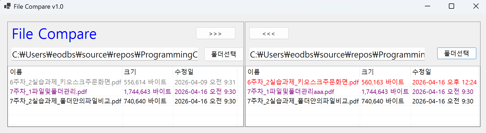
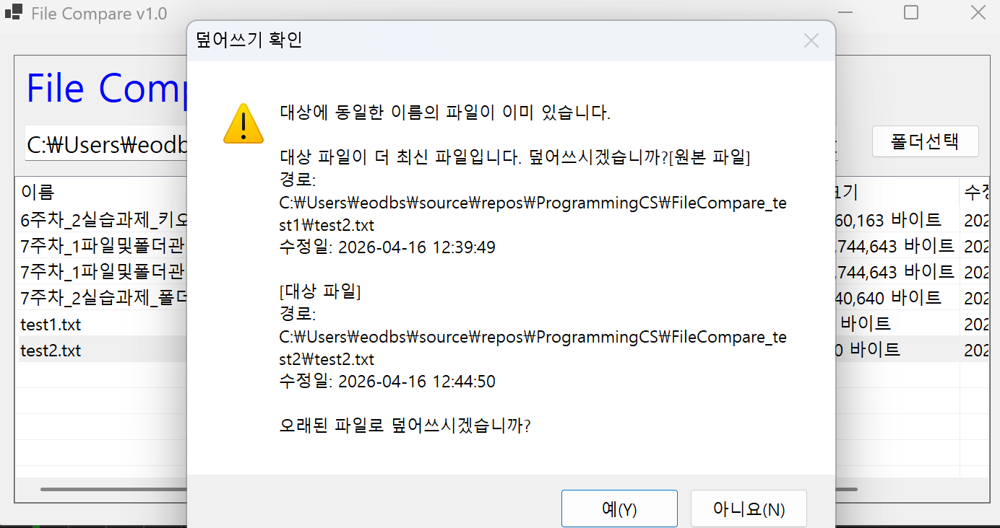

# (C# 코딩) FileCompare

## 개요
- C# 프로그래밍 학습

- 1줄 소개 : 사용자의 입력을 받아서 파일을 비교하는 프로그램

- 사용한 플랫폼 :
  - ```C#```, ```.NET Windows Forms```, ```Visual Studio 2026```, ```GitHub``` 
  
- 사용한 컨트롤 :  
    - ```Label, Button, ListView, TextBox, SplitContainer, Panel```
    
- 사용한 기술과 구현한 기능 :
  - **Windows Forms 앱 (C#)**: `Visual Studio`의 디자이너를 활용하여 직관적인 키오스크 UI(RadioButton, CheckBox) 
  - **레이아웃 속성 활용**: ```Padding```, ```Dock```,```Anchor```를 활용해서 컨트롤 배치 및 자동 조정
  - **Panel 활용** :  ```Panel``` 컨트롤을 활용하여 다른 컨트롤들을 하나로 묶어서 관리
  - **폴더 선택** : ```FolderBrowserDialog```을 활용해서 컴퓨터의 디렉터리 접근
  - **파일 비교** : ```System.IO.File```과 ```System.IO.Directory``` 클래스를 활용해서 파일과 폴더 비교
  
 
- 화면 구성 : 
  
  

## 실행 화면 (과제1)

- 과제1 코드의 실행 스크린샷

.png)
.png)
.png)
.png)


  - 과제 내용
    - 컨트롤 배치와 기본적인 속성 설정 
    - 컨트롤 이름 정하기
    - 레이아웃 속성 설정
    - 파일 불러오기
      
  - 구현 내용과 기능 설명
    - **UI 구성** : ```ListView```와 ```TextBox```등을 적절히 배치
    - **기능 분리** : ```SplitContainer```와 ```Panel```등을 적절히 배치 하여 적절하게 분리
    - **레이아웃 속성** : ```Padding```,```Anchor```, ```Dock```로 적절하게 설정
    - **폴더 선택** : ```FolderBrowserDialog```을 활용해서 컴퓨터의 디렉터리 접근
    - **ListView 속성** : ```ListView```속성을 설정하여 표 형태 변경

    

## 실행 화면 (과제2)

- 과제2 코드의 실행 스크린샷
   


- 과제 내용
   - 폴더 선택 기능과 파일 리스트 기능 구현
   - 양쪽 폴더의 색상 구분 표시(동일 파일– 양쪽 모두 검은색, 다른 파일- New는 빨간색, Old는 회색, 단독 파일- 보라색)
      
- 구현 내용과 기능 설명
   - **폴더 선택 기능** : ```FolderBrowserDialog```을 활용해서 컴퓨터의 디렉터리 접근
   - **폴더 구분 표시** : ```ListView```의 ```BackColor``` 속성을 활용해서 폴더 구분 표시
   - **폴더 상태 정의** : ```enum```을 활용해서 폴더 상태 정의 (예: 동일, 다름, 왼쪽만 존재, 오른쪽만 존재)

## 실행 화면 (과제3)

- 과제3 코드의 실행 스크린샷
    
    .png)
    .png)

 - 과제 내용
    - 양쪽 폴더 사이에서 파일의 복사 기능 구현

 
 - 구현 내용과 기능 설명
    - 선택한 파일을 반대쪽 폴더로 복사
    - 수정된 날짜 정보를 확인해서 "확인"받아 진행여부 결정

- 사용한 기술과 구현한 기능
    - **파일 복사 기능** : ```System.IO.File.Copy``` 메서드를 활용해서 파일 복사


## 실행 화면 (과제4)

 - 과제4 코드의 실행 스크린샷
    .png)
    .png)
   

- 과제 내용
   - 하위폴더에 대해서 한 방에 비교, 복사가 가능하도록 개선

- 구현 내용과 기능 설명
   - 하위폴더를 하나의 파일처럼 처리
   - 적절하게 색상 표시
   - 복사버튼 누르면 하위폴더의 모든 내용(파일과 하위폴더 포함) 처리

- 사용한 기술과 구현한 기능
    - **하위폴더 처리** : ```Directory.GetFiles```와 ```Directory.GetDirectories``` 메서드를 활용해서 하위폴더의 모든 내용 처리
